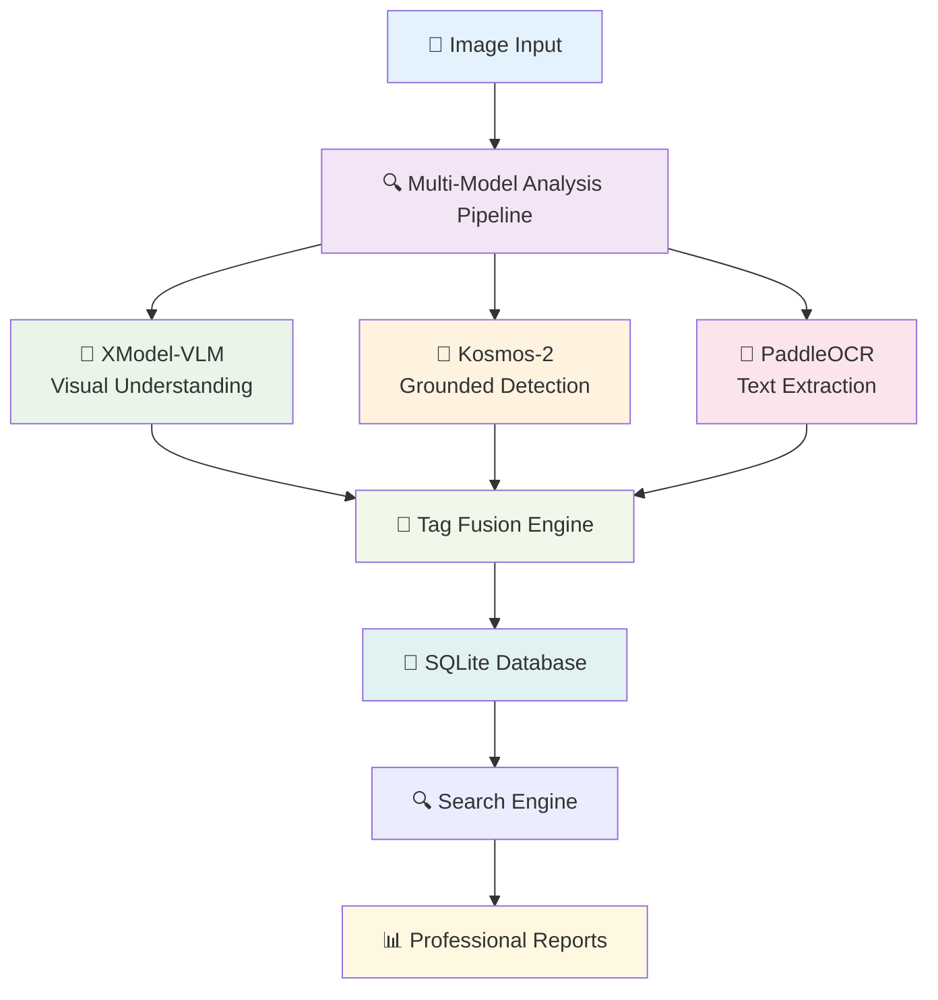

<h1 align="center">🏷️ AI Image Tagging System</h1>

<p align="center">
  
  
  
  
  
</p>

<p align="center">
  <strong>A comprehensive multi-model AI system for intelligent image analysis, semantic tagging, and professional documentation</strong><br>
  Powered by XModel-VLM, Kosmos-2, and PaddleOCR for enterprise-grade image understanding and metadata generation.
</p>

<div align="center">

### 🎯 Perfect for Academic Research • Digital Libraries • Content Management • Professional Archives

</div>

---

## ✨ Key Features

<table align="center">
<tr>
<td width="50%">

**🤖 Multi-Model AI Analysis**
- XModel-VLM for visual understanding
- Kosmos-2 for grounded object detection  
- PaddleOCR for multilingual text extraction
- Intelligent tag fusion and optimization

**📊 Professional Reporting**
- Times New Roman typography
- Executive summaries with insights
- Comprehensive statistics and analytics
- Publication-ready PDF documentation

</td>
<td width="50%">

**🔍 Advanced Search & Discovery**
- Semantic tag-based search
- Full-text content queries
- Relevance-scored results
- Multi-criteria filtering

**🏛️ Enterprise-Ready**
- SQLite database with indexing
- Graceful fallback handling
- Scalable architecture
- Privacy-first offline processing

</td>
</tr>
</table>

---

## 🚀 Quick Start

### System Requirements

<p align="center">


</p>

### Installation Options

<details>
<summary><b>🔧 Option 1: Minimal Setup (Recommended for Quick Start)</b></summary>

```bash
# Install core dependencies only
pip install torch torchvision transformers pillow numpy reportlab

# Clone or download the repository
git clone https://github.com/yourusername/ai-image-tagger.git
cd ai-image-tagger

# Test with basic functionality
python tags.py --file /path/to/test_image.jpg
```

**✅ What works with minimal setup:**
- AI image analysis and tagging
- Professional PDF report generation
- Database storage and search
- Basic image processing

</details>

<details>
<summary><b>🚀 Option 2: Full Feature Installation</b></summary>

```bash
# Install all dependencies for maximum functionality
pip install torch torchvision transformers accelerate
pip install pillow numpy reportlab opencv-python
pip install paddlepaddle paddleocr

# Clone repository
git clone https://github.com/yourusername/ai-image-tagger.git
cd ai-image-tagger

# Run comprehensive analysis
python tags.py --scan /path/to/image_directory
```

**🎯 Additional features with full setup:**
- Enhanced image processing with OpenCV
- Multilingual OCR text extraction
- Advanced computer vision capabilities
- Optimal performance and accuracy

</details>

### Usage Examples

<table>
<tr>
<td width="33%">

**📁 Analyze Directory**
```bash
python tags.py --scan /path/to/images
```
*Recursively processes all supported images*

</td>
<td width="33%">

**🔍 Search Database**
```bash
python tags.py --search "sunset ocean"
```
*Find images by semantic content*

</td>
<td width="33%">

**📄 Generate Report**
```bash
python tags.py --report
```
*Create professional PDF documentation*

</td>
</tr>
</table>

---

## 🏗️ Architecture & Technology Stack

<div align="center">



</div>

### Core Technologies

<div align="center">

| Component | Technology | Purpose | Status |
|-----------|------------|---------|---------|
| **Vision-Language** | XModel-VLM (LLaVA-InternLM2-7B) | Scene understanding & description | 🟢 Active |
| **Grounded Analysis** | Microsoft Kosmos-2 | Object detection & spatial reasoning | 🟢 Active |
| **Text Extraction** | PaddleOCR | Multilingual OCR processing | 🟡 Optional |
| **Deep Learning** | PyTorch + Transformers | Model inference & processing | 🟢 Required |
| **Database** | SQLite with FTS | Metadata storage & search | 🟢 Built-in |
| **Reports** | ReportLab | Professional PDF generation | 🟢 Required |

</div>

---

## 📈 Performance Benchmarks

<div align="center">

| Hardware Configuration | Processing Speed | Memory Usage | Recommended Use Case |
|------------------------|------------------|--------------|---------------------|
| **CPU Only (8 cores)** | ~15-25 sec/image | 3-4GB RAM | Small collections (<1000 images) |
| **RTX 3060 + CPU** | ~5-8 sec/image | 6-8GB RAM | Medium collections (<5000 images) |
| **RTX 4070+ + CPU** | ~3-5 sec/image | 8-12GB RAM | Large collections (5000+ images) |
| **Professional Setup** | ~2-3 sec/image | 12-16GB RAM | Enterprise deployments |

</div>

### Supported Formats

<p align="center">
<code>JPG</code> • <code>JPEG</code> • <code>PNG</code> • <code>BMP</code> • <code>TIFF</code> • <code>TIF</code> • <code>WEBP</code> • <code>GIF</code> • <code>ICO</code> • <code>JFIF</code>
</p>

---

## 💡 Use Cases & Applications

<table>
<tr>
<td width="50%">

### 🎓 **Academic & Research**
- Digital library management
- Research dataset organization  
- Scientific image cataloging
- Art history documentation
- Archaeological archives

### 🏛️ **Institutional**
- Museum collection management
- Government document systems
- Cultural heritage preservation
- Medical image databases
- Legal evidence cataloging

</td>
<td width="50%">

### 💼 **Commercial & Professional**
- Stock photography platforms
- E-commerce product catalogs
- Real estate image management
- News media archives
- Corporate digital assets

### 🔧 **Technical Applications**
- SEO optimization and alt-text
- Accessibility compliance
- Content management systems
- Automated metadata generation
- Search engine enhancement

</td>
</tr>
</table>

---

## 📖 Usage Guide

### Command Line Interface

```bash
# Basic Commands
python tags.py --scan /path/to/images          # Process directory
python tags.py --file image.jpg                # Process single file
python tags.py --search "query terms"          # Search database
python tags.py --report                        # Generate PDF report
python tags.py --stats                         # Show statistics

# Advanced Options
python tags.py --scan /images --db-path custom.db     # Custom database
python tags.py --search "cats" --limit 50             # Limit results
python tags.py --report --pdf-output custom_name.pdf  # Custom report name
python tags.py --scan /images --no-recursive          # Single directory only
```

### Interactive Mode

```bash
python tags.py
# Interactive console starts
🏷️ AI-Tagger> scan /path/to/images
🏷️ AI-Tagger> search sunset beach
🏷️ AI-Tagger> report
🏷️ AI-Tagger> stats
🏷️ AI-Tagger> quit
```

---

## 📊 Sample Output

### Generated Tags Example
```
✅ Processing: sunset_beach_vacation.jpg
🏷️ Generated Tags (18): sunset, ocean, beach, orange, sky, water, 
    horizon, peaceful, nature, landscape, outdoor, scenic, golden, 
    waves, sand, tropical, vacation, relaxing
⏱️ Processing time: 4.2 seconds
📄 Individual report generated
```

### Search Results
```bash
🔍 Searching for: 'ocean sunset'
🎯 Found 12 matching images

1. sunset_beach.jpg
   📁 Path: /photos/vacation/sunset_beach.jpg  
   📏 Size: 1920 × 1080
   🏷️ Tags: **sunset**, **ocean**, beach, orange, sky, golden
   ⭐ Relevance: 95

2. ocean_waves.jpg  
   📁 Path: /photos/nature/ocean_waves.jpg
   📏 Size: 1600 × 900
   🏷️ Tags: **ocean**, waves, blue, water, nature
   ⭐ Relevance: 80
```

---

## 📁 Project Structure

```
ai-image-tagger/
├── 📄 tags.py                    # Main application file
├── 📄 requirements.txt           # Python dependencies  
├── 📄 README.md                  # This documentation
├── 📄 LICENSE                    # MIT License
├── 📁 docs/                      # Additional documentation
│   ├── 📄 installation.md        # Detailed setup guide
│   ├── 📄 troubleshooting.md     # Common issues & solutions
│   └── 📄 api_reference.md       # Code documentation
├── 📁 examples/                  # Example usage and demos
│   ├── 🖼️ sample_images/         # Test images
│   └── 📄 demo_outputs/          # Sample reports
└── 📁 tests/                     # Unit tests (optional)
    ├── 📄 test_basic.py
    └── 📄 test_models.py
```

---

## 🔧 Configuration & Customization

<details>
<summary><b>⚙️ Advanced Configuration Options</b></summary>

### Environment Variables
```bash
# Model preferences (if using alternatives)
export PREFERRED_VLM_MODEL="microsoft/git-base-coco"
export PREFERRED_KOSMOS_MODEL="microsoft/kosmos-2-patch14-224"

# Database configuration
export DB_PATH="./custom_database.db"  
export MAX_TAGS_PER_IMAGE=25

# Processing options
export BATCH_SIZE=10
export PROCESSING_TIMEOUT=30
```

### Custom Model Configuration
```python
# Modify in tags.py for custom models
FALLBACK_MODELS = [
    "microsoft/git-base-coco",
    "nlpconnect/vit-gpt2-image-captioning", 
    "Salesforce/blip-image-captioning-base"
]
```

</details>

---

## 🛠️ Troubleshooting

<details>
<summary><b>🔍 Common Issues & Solutions</b></summary>

### Installation Issues
```bash
# If PyTorch installation fails
pip install torch torchvision --index-url https://download.pytorch.org/whl/cpu

# If transformers model downloads fail  
pip install --upgrade transformers accelerate

# Permission errors
pip install --user torch torchvision transformers pillow numpy reportlab
```

### Runtime Issues
```bash
# Check what's working
python -c "
import torch; print('✅ PyTorch:', torch.__version__)
from transformers import AutoModel; print('✅ Transformers available')
from PIL import Image; print('✅ PIL available')
print('✅ System ready for processing')
"

# Test basic functionality
python tags.py --stats
```

### Performance Optimization
- **CPU**: Use `--batch-size 5` for limited RAM
- **GPU**: Ensure CUDA drivers are updated
- **Storage**: Use SSD for database for faster search
- **Memory**: Close other applications during processing

</details>

---

## 📜 License & Citation

This project is licensed under the **MIT License** - see the [LICENSE](LICENSE) file for details.

### Citation
If you use this system in academic research, please cite:
```bibtex
@software{ai_image_tagging_system,
  title={AI Image Tagging System: Multi-Model Visual Understanding},
  author={Your Name},
  year={2024},
  url={https://github.com/yourusername/ai-image-tagger}
}
```

---

## 🤝 Contributing & Support

### Contributing
1. Fork the repository
2. Create a feature branch (`git checkout -b feature/amazing-feature`)
3. Commit your changes (`git commit -m 'Add amazing feature'`)
4. Push to the branch (`git push origin feature/amazing-feature`)
5. Open a Pull Request

### Support
- 📫 **Issues**: [GitHub Issues](https://github.com/yourusername/ai-image-tagger/issues)
- 💬 **Discussions**: [GitHub Discussions](https://github.com/yourusername/ai-image-tagger/discussions)
- 📖 **Documentation**: [Wiki](https://github.com/yourusername/ai-image-tagger/wiki)

---

<div align="center">

### 🌟 Star this repository if you find it useful! 🌟

**Made with ❤️ for the AI and Computer Vision community**

*Empowering intelligent image understanding through multi-model AI integration*

</div>
