<h1 align="center">VisionVault</h1>

<p align="center">
  
  
  
  
</p>

<p align="center">
  <strong>An intelligent image analysis and tagging system powered by Vision-Language Models (VLMs)</strong><br>
  Automatically analyze, tag, and search through your image collections using state-of-the-art AI models.
</p>

## 🌟 Features

<table align="center">
<tr align>
<td width="50%">

**🤖 Dual AI Analysis**
- Uses both BLIP and LLaVA models
- Comprehensive image understanding
- Advanced scene recognition

**🔍 Intelligent Search**  
- Natural language queries
- Content-based image retrieval
- Fast SQLite database

</td>
<td width="50%">

**📁 Recursive Scanning**
- Processes entire directory trees  
- Supports multiple image formats
- Automatic duplicate detection

**🔒 Privacy-First**
- Completely offline processing
- No cloud APIs required
- Local metadata storage

</td>
</tr>
</table>


## 🚀 Quick Start

### Prerequisites

<p>


</p>

1. **Python 3.8+** with pip installed
2. **[Ollama](https://ollama.ai/)** installed and running

### Installation

<details>
<summary><b>📦 Step-by-Step Installation</b></summary>

```bash
# 1. Clone the repository
git clone https://github.com/yourusername/visionvault.git
cd visionvault

# 2. Create virtual environment
python -m venv venv
source venv/bin/activate  # On Windows: venv\Scripts\activate

# 3. Install dependencies
pip install -r requirements.txt

# 4. Install Ollama (if not already installed)
curl -fsSL https://ollama.ai/install.sh | sh

# 5. Start Ollama service
ollama serve

# 6. Pull vision model (in new terminal)
ollama pull llava:7b
```

</details>

### Usage

<table>
<tr>
<td width="33%">

**📂 Scan Images**
```bash
python main_simple.py --scan "/path/to/images"
```

</td>
<td width="33%">

**🔍 Search Images**
```bash
python main_simple.py --search "van gogh paintings"
```

</td>
<td width="33%">

**💬 Interactive Mode**
```bash
python main_simple.py
> scan /home/user/Pictures
> search cats and dogs
```

</td>
</tr>
</table>


## 🛠️ Tech Stack

<div align="center">

| Component | Technology | Purpose |
|-----------|------------|---------|
| **Vision Models** | BLIP + LLaVA | Image analysis & understanding |
| **Framework** | PyTorch + Transformers | Deep learning inference |
| **Database** | SQLite | Metadata storage |
| **Serving** | Ollama | Local model hosting |
| **Processing** | PIL/Pillow | Image manipulation |

</div>


## 🏗️ Architecture

```mermaid
graph TD
    A[📁 Image Files] --> B[🤖 Image Analyzer]
    B --> C[🎨 BLIP Model]
    B --> D[👁️ LLaVA Model]
    C --> E[📊 Metadata Extractor]
    D --> E
    E --> F[💾 SQLite Database]
    F --> G[🔍 Search Engine]
    G --> H[📋 Results]
    
    style A fill:#e1f5fe
    style B fill:#f3e5f5
    style C fill:#e8f5e8
    style D fill:#fff3e0
    style F fill:#fce4ec
```

<div align="center">



</div>

## Performance

<div align="center">

| Hardware | Processing Speed | Memory Usage | Recommended For |
|----------|------------------|--------------|-----------------|
| **CPU Only** | ~30 sec/image | 2-3GB RAM | Small collections |
| **RTX 3060** | ~10 sec/image | 4-6GB RAM | Medium collections |
| **RTX 4070** | ~5 sec/image | 6-8GB RAM | Large collections |

</div>


</details>


## 📁 Project Structure

```
visionvault/
├── 📄 main_simple.py          # Main application (simple version)
├── 📄 main.py                 # Full-featured version  
├── 📄 requirements.txt        # Python dependencies
├── 📄 README.md              # This file
├── 📄 LICENSE                # MIT License
├── 📁 examples/              # Example images and usage
│   ├── 🖼️ sample_images/
│   └── 📄 usage_examples.py
└── 📁 docs/                  # Documentation
    ├── 📄 installation.md
    ├── 📄 configuration.md
    └── 📄 troubleshooting.md
```

<summary><b>🌍 Environment Variables</b></summary>

```bash
# Ollama server configuration
export OLLAMA_HOST=127.0.0.1:11434

# Model preferences
export PREFERRED_VLM_MODEL=llava:7b

# Database configuration  
export DB_PATH=./image_database.db
```

</details>


### Development Setup

```bash
# Clone with development dependencies
git clone https://github.com/yourusername/visionvault.git
cd visionvault

# Install development dependencies  
pip install -r requirements-dev.txt

# Run tests
python -m pytest tests/

# Format code
black .
isort .
```

</div>

