<h1 align="center">🔍 VisionVault</h1>

<p align="center">
  
  
  
  
  
  
</p>

<p align="center">
  <strong>Beyond Single-Model Tagging: Multi-Perspective Image Analysis for Enhanced Content Understanding</strong><br>
  <div align="justify">
  Comprehensive image analysis pipeline combining multiple state-of-the-art vision models for intelligent tagging, content detection, and detailed visual understanding. VisionVault integrates BLIP captioning, LayoutLMv3 document analysis, ViT-GPT2 descriptions, and InstructBLIP advanced reasoning to deliver professional-grade image analysis with automated report generation.
  </div>
</p>

## 🌟 System Features

<table align="center">
<tr>
<td width="50%">

**🖼️ Advanced Image Processing**
- Multi-model ensemble analysis
- Intelligent tag generation and verification
- OCR and text extraction capabilities
- Comprehensive visual content understanding
- Batch processing for large datasets

**🤖 Four-Model Architecture**
- BLIP for intelligent image captioning
- LayoutLMv3 for document layout analysis
- ViT-GPT2 for detailed descriptions
- InstructBLIP for advanced visual reasoning

</td>
<td width="50%">

**📊 Professional Reporting**
- Automated PDF report generation
- Comprehensive analysis summaries
- Visual content cataloging
- Batch processing statistics
- Professional formatting with images

**🔧 Enterprise Features**
- GPU acceleration support
- Memory-efficient processing
- Quantized model support (8-bit)
- Flexible input/output handling
- Robust error handling and validation

</td>
</tr>
</table>

## 🚀 Quick Start

### Prerequisites

<p>


</p>

<div align="justify">

**System Requirements:**
1. **Python 3.8+** with CUDA support (recommended for GPU acceleration)
2. **8GB+ RAM** for model inference (16GB recommended for InstructBLIP)
3. **Image processing libraries** for comprehensive analysis
4. **6GB+ storage** for models and output reports

</div>

### Installation

<details>
<summary><b>🔧 Complete Setup Guide</b></summary>

```bash
# 1. Clone the repository
git clone https://github.com/yourusername/visionvault.git
cd visionvault

# 2. Create virtual environment
python -m venv venv
source venv/bin/activate  # On Windows: venv\Scripts\activate

# 3. Install core dependencies
pip install transformers torch pillow reportlab opencv-python
pip install datasets accelerate bitsandbytes

# 4. Install additional libraries
pip install Pillow>=8.0.0
pip install reportlab>=3.6.0

# 5. Create required directories
mkdir -p data output_reports

# 6. Verify installation
python -c "import torch; print(f'CUDA available: {torch.cuda.is_available()}')"
```

</details>

<details>
<summary><b>📋 Requirements Installation</b></summary>

```bash
# Install all dependencies at once
pip install transformers torch pillow reportlab opencv-python datasets accelerate bitsandbytes

# For Jupyter notebook environment
%pip install transformers torch pillow reportlab opencv-python datasets accelerate bitsandbytes
```

</details>

## 🎯 System Architecture

```mermaid
graph TD
    A[🖼️ Image Input] --> B[🔧 Path Validation]
    B --> C[🤖 Model 1: BLIP]
    C --> D[📝 Text Extraction]
    D --> E[✅ Model 2: LayoutLMv3]
    E --> F[📖 Model 3: ViT-GPT2]
    F --> G[🧠 Model 4: InstructBLIP]
    G --> H[📊 Result Compilation]
    H --> I[📄 PDF Report Generation]
    
    C --> C1[Tag Generation]
    C --> C2[Caption Creation]
    C --> C3[Multi-prompt Analysis]
    
    E --> E1[Tag Verification]
    E --> E2[Layout Analysis]
    E --> E3[Confidence Scoring]
    
    F --> F1[Visual Description]
    F --> F2[Scene Understanding]
    
    G --> G1[Advanced Reasoning]
    G --> G2[Detailed Explanation]
    G --> G3[Context Analysis]
    
    I --> I1[Professional Layout]
    I --> I2[Image Embedding]
    I --> I3[Comprehensive Summary]
```

<div align="center">



</div>

## 📁 Core System Components

<div align="justify">

### **🎯 Model 1: BLIP - Intelligent Tag Generation**
Advanced image captioning and tag generation using Salesforce's BLIP model. Employs multiple analysis methods including basic captioning, question-based extraction, and direct object detection prompts to generate comprehensive tags from visual content.

**Key Features:**
- Multi-method tag extraction (8 different approaches)
- Intelligent filtering and deduplication
- Comprehensive visual element detection
- Advanced prompt-based analysis

### **📋 Model 2: LayoutLMv3 - Document Layout Analysis**
Microsoft's LayoutLMv3 model for document understanding and tag verification. Processes layout information, text positioning, and visual elements to validate and enhance generated tags with spatial awareness.

**Key Features:**
- Layout-aware tag verification
- Spatial relationship analysis
- Confidence-based tag scoring
- Document structure understanding

### **🖼️ Model 3: ViT-GPT2 - Visual Description Generation**
Vision Transformer combined with GPT-2 for detailed image descriptions. Generates natural language descriptions that complement the tag-based analysis with contextual understanding.

**Key Features:**
- Natural language generation
- Visual scene understanding
- Contextual description creation
- Temperature-controlled creativity

### **🧠 Model 4: InstructBLIP - Advanced Visual Reasoning**
Salesforce's InstructBLIP for sophisticated visual question answering and detailed image analysis. Provides comprehensive explanations and advanced reasoning about visual content.

**Key Features:**
- Advanced visual reasoning
- Multi-prompt comprehensive analysis
- Detailed explanations generation
- 8-bit quantization for efficiency

</div>

## 🔬 Model Specifications & Performance

### Model Configuration

<table>
<tr>
<td width="50%">

**🎯 Model Setup**
```yaml
BLIP: Salesforce/blip-image-captioning-base
LayoutLMv3: microsoft/layoutlmv3-base
ViT-GPT2: nlpconnect/vit-gpt2-image-captioning
InstructBLIP: Salesforce/instructblip-flan-t5-xl
Quantization: 8-bit (GPU), Float32 (CPU)
Device: Auto-detection (CUDA/CPU)
```

</td>
<td width="50%">

**📈 Performance Metrics**
- **Processing Speed**: ~3-5 seconds per image
- **Tag Generation**: 10-20 tags per image
- **Verification Rate**: 60-80% tag retention
- **Memory Usage**: 4-8GB GPU memory
- **Batch Support**: Unlimited image processing

</td>
</tr>
</table>

### Hardware Optimization

```python
# GPU Memory Management
OPTIMIZATION_CONFIG = {
    "use_8bit": True,  # For InstructBLIP memory efficiency
    "device_map": "auto",  # Automatic GPU allocation
    "torch_dtype": torch.float16,  # Half precision
    "max_length": 2048,  # Token limit optimization
    "batch_size": 1  # Memory-safe processing
}
```

## 💬 Advanced Tag Generation System

<details>
<summary><b>🏷️ Multi-Method Tag Extraction</b></summary>

<div align="justify">

### Comprehensive Tag Generation Pipeline
```python
def generate_comprehensive_tags_with_blip(image_path):
    """
    Advanced tag generation using multiple extraction methods
    """
    methods = [
        "Basic image captioning",
        "Question-based extraction (8 questions)",
        "Direct object detection prompts (5 prompts)",
        "Intelligent filtering and validation",
        "Deduplication and ranking"
    ]
```

### Question-Based Extraction System
The system employs 8 strategic questions to extract comprehensive information:
- **Object Detection**: "What objects are in this image?"
- **Color Analysis**: "What colors can you see?"
- **Subject Identification**: "What is the main subject?"
- **Scene Classification**: "What type of scene is this?"
- **Activity Recognition**: "What activities are happening?"
- **Location Context**: "What is the setting or location?"
- **Entity Detection**: "What animals or people are present?"
- **Item Recognition**: "What items or tools are visible?"

</div>

</details>

## 🖥️ Usage Examples

### Single Image Analysis

```python
# Process a single image with all 4 models
result = process_single_image_with_4_models("path/to/your/image.jpg")

# Access results
print(f"Generated Tags: {result['blip_tags']}")
print(f"BLIP Caption: {result['blip_caption']}")
print(f"Verified Tags: {result['verified_tags']}")
print(f"ViT Description: {result['vit_description']}")
print(f"InstructBLIP Analysis: {result['instructblip_explanation']}")
```

### Batch Directory Processing

```python
# Process entire directory
data_directory = "C:\\path\\to\\your\\images"
all_results = process_all_images_with_4_models(data_directory)

# Generate comprehensive PDF report
output_dir = ensure_output_dir()
pdf_path = create_single_comprehensive_report(all_results, output_dir)

print(f"Analysis complete! Report saved: {pdf_path}")
```

### Advanced Configuration

```python
# Customize processing parameters
import torch

# Set device preference
device = torch.device("cuda" if torch.cuda.is_available() else "cpu")

# Configure model parameters
MODEL_CONFIG = {
    "max_length": 50,  # Caption length
    "num_beams": 5,    # Beam search
    "temperature": 0.7, # Creativity control
    "do_sample": True   # Sampling strategy
}
```

## 📊 Professional Report Generation

<div align="center">

| Report Feature | Implementation | Output Quality |
|----------------|----------------|----------------|
| **PDF Layout** | Professional formatting with headers | Publication-ready |
| **Image Embedding** | Direct image inclusion in reports | High-resolution display |
| **Statistical Summary** | Comprehensive analysis metrics | Data-driven insights |
| **Individual Analysis** | Per-image detailed breakdowns | Complete documentation |
| **Batch Statistics** | Processing time and success rates | Performance monitoring |

</div>

## 🔧 Technical Implementation Details

### Image Processing Pipeline

<div align="justify">

**Validation & Preprocessing:**
- **Path Handling**: Intelligent path resolution and validation
- **Format Support**: JPG, JPEG, PNG, BMP, TIFF, WebP
- **Error Handling**: Comprehensive validation and recovery
- **Memory Management**: Efficient image loading and processing

**Multi-Model Coordination:**
- **Sequential Processing**: Optimized model execution order
- **State Management**: Consistent data flow between models
- **Error Recovery**: Graceful handling of model failures
- **Result Aggregation**: Intelligent combination of model outputs

</div>

### Output Generation System

```python
class ComprehensiveAnalysisResult:
    """Complete analysis result structure"""
    
    def __init__(self):
        self.filename: str = ""
        self.image_path: str = ""
        self.blip_tags: List[str] = []
        self.blip_caption: str = ""
        self.extracted_text: str = ""
        self.verified_tags: List[str] = []
        self.vit_description: str = ""
        self.instructblip_explanation: str = ""
```

## 🌐 System Outputs & Reports

<div align="justify">

### Professional PDF Reports
VisionVault generates comprehensive PDF reports with professional formatting including:

**📋 Executive Summary**: Processing statistics, model performance, and analysis overview with total images processed, tag generation rates, and verification statistics.

**🖼️ Individual Analysis**: Detailed per-image breakdowns with embedded images, all model outputs, tag comparisons, and comprehensive analysis results.

**📊 Batch Statistics**: Performance metrics including processing times, success rates, average tags per image, and model reliability statistics.

</div>

### Report Structure

```
output_reports/
├── comprehensive_4model_analysis_YYYYMMDD_HHMMSS.pdf
├── processing_logs/
│   ├── batch_statistics.json
│   ├── model_performance.json
│   └── error_reports.json
└── individual_results/
    ├── image1_analysis.json
    ├── image2_analysis.json
    └── ...
```

## 🛠️ Advanced Configuration

<details>
<summary><b>🔧 Model Configuration Options</b></summary>

```python
# Advanced system configuration
SYSTEM_CONFIG = {
    "image_processing": {
        "supported_formats": ['.jpg', '.jpeg', '.png', '.bmp', '.tiff', '.webp'],
        "max_image_size": "unlimited",
        "color_mode": "RGB"
    },
    "model_settings": {
        "use_gpu": True,
        "quantization": "8bit",  # For memory optimization
        "max_tokens": 2048,
        "batch_processing": True
    },
    "output_settings": {
        "generate_pdf": True,
        "embed_images": True,
        "professional_formatting": True,
        "include_statistics": True
    }
}
```

</details>

<details>
<summary><b>📊 Performance Optimization</b></summary>

```python
# Memory and speed optimization
OPTIMIZATION_SETTINGS = {
    "gpu_memory_fraction": 0.8,  # GPU memory limit
    "cpu_threads": 4,            # CPU thread count  
    "image_batch_size": 1,       # Memory-safe batching
    "model_caching": True,       # Faster subsequent runs
    "progress_tracking": True    # Real-time progress updates
}
```

</details>

## 📚 Research Foundation & Applications

<div align="justify">

### Computer Vision Innovation
VisionVault represents a novel approach to multi-model computer vision analysis by combining complementary vision architectures. The system leverages the strengths of each model: BLIP's captioning capabilities, LayoutLMv3's document understanding, ViT-GPT2's natural language generation, and InstructBLIP's advanced reasoning.

### Professional Applications
- **Digital Asset Management**: Automated tagging and cataloging of large image collections
- **Content Analysis**: Comprehensive understanding of visual content for media companies
- **Document Processing**: Layout-aware analysis of complex documents and forms
- **Research & Development**: Academic and commercial computer vision research projects
- **Quality Assurance**: Automated visual content verification and analysis

</div>

## 🤝 Contributing

<div align="justify">

We welcome contributions from computer vision researchers, developers, and data scientists. VisionVault is designed to be an extensible platform for advancing multi-model vision analysis.

</div>

<details>
<summary><b>🛠️ Development Setup</b></summary>

```bash
# Install development dependencies
pip install -r requirements-dev.txt

# Run system tests
python tags.ipynb  # Execute notebook cells

# Test individual components
python -c "from PIL import Image; print('PIL working')"
python -c "import torch; print(f'PyTorch: {torch.__version__}')"
python -c "import transformers; print(f'Transformers: {transformers.__version__}')"

# Validate model loading
python -c "
from transformers import BlipProcessor
processor = BlipProcessor.from_pretrained('Salesforce/blip-image-captioning-base')
print('BLIP model validation successful')
"
```

</details>

### Priority Contribution Areas

- 🖼️ **Model Integration**: Additional state-of-the-art vision models
- 🔧 **Performance Optimization**: Faster processing and memory efficiency
- 📱 **Format Support**: Additional image and document formats
- 🌍 **Multilingual Support**: Non-English text detection and analysis
- 📊 **Analytics Dashboard**: Web-based visualization and monitoring
- 🤖 **API Development**: RESTful API for enterprise integration

## 🎓 Model Details & Capabilities

### BLIP (Bootstrapping Language-Image Pre-training)
- **Purpose**: Primary image captioning and tag generation
- **Strength**: Natural language understanding of visual content
- **Output**: Comprehensive tags and descriptive captions

### LayoutLMv3 (Layout Language Model v3)
- **Purpose**: Document layout analysis and tag verification
- **Strength**: Spatial relationship understanding
- **Output**: Verified tags with confidence scoring

### ViT-GPT2 (Vision Transformer + GPT-2)
- **Purpose**: Detailed visual description generation
- **Strength**: Natural language description of scenes
- **Output**: Contextual image descriptions

### InstructBLIP (Instruction-tuned BLIP)
- **Purpose**: Advanced visual reasoning and explanation
- **Strength**: Complex visual question answering
- **Output**: Detailed analysis and explanations

## 📄 License & Usage

This project is licensed under the MIT License - see the [LICENSE](LICENSE) file for details.

**Performance Note**: VisionVault is designed for professional-grade image analysis and requires sufficient computational resources for optimal performance. GPU acceleration is highly recommended for processing large image collections.

<div align="center">

**🔍 Unlocking the full potential of visual content through advanced AI analysis 🔍**

*Developed for comprehensive, professional-grade computer vision applications*

---

<p align="center">
  <sub>VisionVault - Where multiple AI models converge for superior visual understanding</sub>
</p>

</div>
