<h1 align="center">🖼️ VisionVault</h1>

<p align="center">
  
  
  
  
</p>

<p align="center">
  <strong>An intelligent image analysis and tagging system powered by Vision-Language Models (VLMs)</strong><br>
  Automatically analyze, tag, and search through your image collections using state-of-the-art AI models.
</p>


---

## 🌟 Features

<table>
<tr>
<td width="50%">

**🤖 Dual AI Analysis**
- Uses both BLIP and LLaVA models
- Comprehensive image understanding
- Advanced scene recognition

**🔍 Intelligent Search**  
- Natural language queries
- Content-based image retrieval
- Fast SQLite database

</td>
<td width="50%">

**📁 Recursive Scanning**
- Processes entire directory trees  
- Supports multiple image formats
- Automatic duplicate detection

**🔒 Privacy-First**
- Completely offline processing
- No cloud APIs required
- Local metadata storage

</td>
</tr>
</table>

---

## 🚀 Quick Start

### Prerequisites

<p>


</p>

1. **Python 3.8+** with pip installed
2. **[Ollama](https://ollama.ai/)** installed and running

### Installation

<details>
<summary><b>📦 Step-by-Step Installation</b></summary>

```bash
# 1. Clone the repository
git clone https://github.com/yourusername/visionvault.git
cd visionvault

# 2. Create virtual environment
python -m venv venv
source venv/bin/activate  # On Windows: venv\Scripts\activate

# 3. Install dependencies
pip install -r requirements.txt

# 4. Install Ollama (if not already installed)
curl -fsSL https://ollama.ai/install.sh | sh

# 5. Start Ollama service
ollama serve

# 6. Pull vision model (in new terminal)
ollama pull llava:7b
```

</details>

### Usage

<table>
<tr>
<td width="33%">

**📂 Scan Images**
```bash
python main_simple.py --scan "/path/to/images"
```

</td>
<td width="33%">

**🔍 Search Images**
```bash
python main_simple.py --search "van gogh paintings"
```

</td>
<td width="33%">

**💬 Interactive Mode**
```bash
python main_simple.py
> scan /home/user/Pictures
> search cats and dogs
```

</td>
</tr>
</table>

---

## 🛠️ Tech Stack

<div align="center">

| Component | Technology | Purpose |
|-----------|------------|---------|
| **Vision Models** | BLIP + LLaVA | Image analysis & understanding |
| **Framework** | PyTorch + Transformers | Deep learning inference |
| **Database** | SQLite | Metadata storage |
| **Serving** | Ollama | Local model hosting |
| **Processing** | PIL/Pillow | Image manipulation |

</div>

---

## 🏗️ Architecture

```mermaid
graph TD
    A[📁 Image Files] --> B[🤖 Image Analyzer]
    B --> C[🎨 BLIP Model]
    B --> D[👁️ LLaVA Model]
    C --> E[📊 Metadata Extractor]
    D --> E
    E --> F[💾 SQLite Database]
    F --> G[🔍 Search Engine]
    G --> H[📋 Results]
    
    style A fill:#e1f5fe
    style B fill:#f3e5f5
    style C fill:#e8f5e8
    style D fill:#fff3e0
    style F fill:#fce4ec
```

<div align="center">



</div>

---

## 📊 Performance

<div align="center">

| Hardware | Processing Speed | Memory Usage | Recommended For |
|----------|------------------|--------------|-----------------|
| **CPU Only** | ~30 sec/image | 2-3GB RAM | Small collections |
| **RTX 3060** | ~10 sec/image | 4-6GB RAM | Medium collections |
| **RTX 4070** | ~5 sec/image | 6-8GB RAM | Large collections |

</div>

---

## 🖼️ Supported Formats

<p align="center">


</p>

---

## 🔍 Example Searches

<details>
<summary><b>💡 Search Examples</b></summary>

```bash
# Content-based searches
python main_simple.py --search "dogs playing in park"
python main_simple.py --search "code screenshots"
python main_simple.py --search "van gogh style paintings"

# Color-based searches  
python main_simple.py --search "images with blue sky"
python main_simple.py --search "yellow flowers"

# Scene-based searches
python main_simple.py --search "indoor office scenes"
python main_simple.py --search "outdoor nature photos"

# Activity-based searches
python main_simple.py --search "people eating food"
python main_simple.py --search "cars on highway"
```

</details>

---

## 📁 Project Structure

```
visionvault/
├── 📄 main_simple.py          # Main application (simple version)
├── 📄 main.py                 # Full-featured version  
├── 📄 requirements.txt        # Python dependencies
├── 📄 README.md              # This file
├── 📄 LICENSE                # MIT License
├── 📁 examples/              # Example images and usage
│   ├── 🖼️ sample_images/
│   └── 📄 usage_examples.py
└── 📁 docs/                  # Documentation
    ├── 📄 installation.md
    ├── 📄 configuration.md
    └── 📄 troubleshooting.md
```

---

## ⚙️ Configuration

<details>
<summary><b>🔧 Command Line Options</b></summary>

```bash
python main_simple.py [OPTIONS]

Options:
  --scan PATH        Directory path to scan for images
  --search QUERY     Search query for images  
  --db-path PATH     Database file path (default: ./image_database.db)
  --limit NUMBER     Limit number of search results (default: 10)
  --help            Show help message
```

</details>

<details>
<summary><b>🌍 Environment Variables</b></summary>

```bash
# Ollama server configuration
export OLLAMA_HOST=127.0.0.1:11434

# Model preferences
export PREFERRED_VLM_MODEL=llava:7b

# Database configuration  
export DB_PATH=./image_database.db
```

</details>

---

## 💾 Database Schema

<details>
<summary><b>📊 SQLite Database Structure</b></summary>

```sql
CREATE TABLE images (
    id TEXT PRIMARY KEY,           -- SHA256 hash of file
    file_path TEXT UNIQUE,         -- Absolute path to image
    file_name TEXT,                -- Original filename
    file_hash TEXT,                -- File hash for deduplication
    created_at TEXT,               -- Processing timestamp
    file_size INTEGER,             -- File size in bytes
    width INTEGER,                 -- Image width
    height INTEGER,                -- Image height
    format TEXT,                   -- Image format (JPEG, PNG, etc.)
    blip_analysis TEXT,            -- BLIP model analysis (JSON)
    llava_analysis TEXT,           -- LLaVA model analysis (JSON)
    tags TEXT,                     -- Generated tags (comma-separated)
    search_text TEXT               -- Searchable text content
);
```

</details>

---

## 🐛 Troubleshooting

<details>
<summary><b>⚠️ Common Issues & Solutions</b></summary>

**1. Ollama Connection Error**
```bash
# Make sure Ollama is running
ollama serve

# Check if vision models are installed
ollama list
```

**2. Out of Memory Errors**  
```bash
# Use CPU-only mode
export CUDA_VISIBLE_DEVICES=""
```

**3. Model Download Issues**
```bash
# Clear Hugging Face cache
rm -rf ~/.cache/huggingface/

# Retry model download
python -c "from transformers import BlipProcessor; BlipProcessor.from_pretrained('Salesforce/blip-image-captioning-base')"
```

**4. Permission Errors**
```bash
# Ensure read access to image directories
chmod -R +r /path/to/images
```

</details>

---

## 🤝 Contributing

<p align="center">
We welcome contributions! Please see our <a href="CONTRIBUTING.md">Contributing Guidelines</a> for details.
</p>

<div align="center">

### Development Setup

```bash
# Clone with development dependencies
git clone https://github.com/yourusername/visionvault.git
cd visionvault

# Install development dependencies  
pip install -r requirements-dev.txt

# Run tests
python -m pytest tests/

# Format code
black .
isort .
```

</div>

---

## 📄 License

<p align="center">
This project is licensed under the MIT License - see the <a href="LICENSE">LICENSE</a> file for details.
</p>

---

## 🙏 Acknowledgments

<div align="center">

**Built with amazing open-source technologies:**

<a href="https://github.com/salesforce/BLIP"></a>
<a href="https://llava-vl.github.io/"></a>
<a href="https://ollama.ai/"></a>
<a href="https://huggingface.co/"></a>

</div>

---

## 📞 Support

<div align="center">

<a href="https://github.com/yourusername/visionvault/issues"></a>
<a href="https://github.com/yourusername/visionvault/discussions"></a>
<a href="mailto:your.email@example.com"></a>

</div>

---

## 🗺️ Roadmap

<details>
<summary><b>🚀 Future Features</b></summary>

- [ ] **🌐 Web Interface**: Browser-based UI for easier interaction
- [ ] **🔍 Advanced Search**: Vector similarity search with embeddings  
- [ ] **⚡ Batch Processing**: Parallel processing for faster scanning
- [ ] **☁️ Cloud Integration**: Optional cloud storage and sync
- [ ] **📱 Mobile App**: Mobile application for image tagging
- [ ] **🔌 Plugin System**: Extensible architecture for custom analyzers

</details>

---

<div align="center">
  
**⭐ Star this repository if you find it helpful!**

<a href="https://github.com/yourusername/visionvault/stargazers"></a>
<a href="https://github.com/yourusername/visionvault/network/members"></a>

---

<sub>Made with ❤️ by <a href="https://github.com/yourusername">Your Name</a></sub>

</div>
